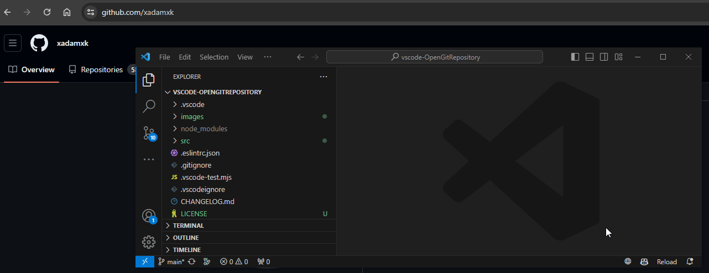
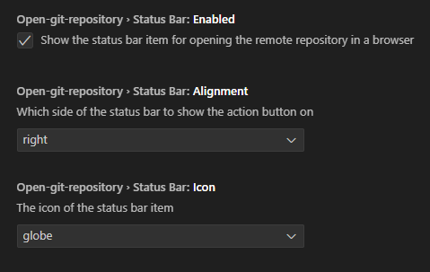

# Open Git Repository Extension (OGRE)
   

### Open git repository links in your browser (BitBucket, GitHub, GitLab, SourceForge, and more!)

**Supported git providers**: BitBucket, GitHub, GitLab, and more!

## Features

- Adds status bar icon to open the repository in your browser
- Adds context menu option to open the selected file in your browser
- Fully customizable status bar controls (enable/disable, alignment, and customizable icons)

### Commands

- `Open Repository in Browser` Opens the git project at it's remote location
- `Open File in Browser` Opens the file at it's remote location

## Extension Settings

## Release Notes

1.0.1
- Fixes url generation for ssh based origins
- Updates status bar icon on setting change (excludes alignment)

1.0.0
- Initial release
